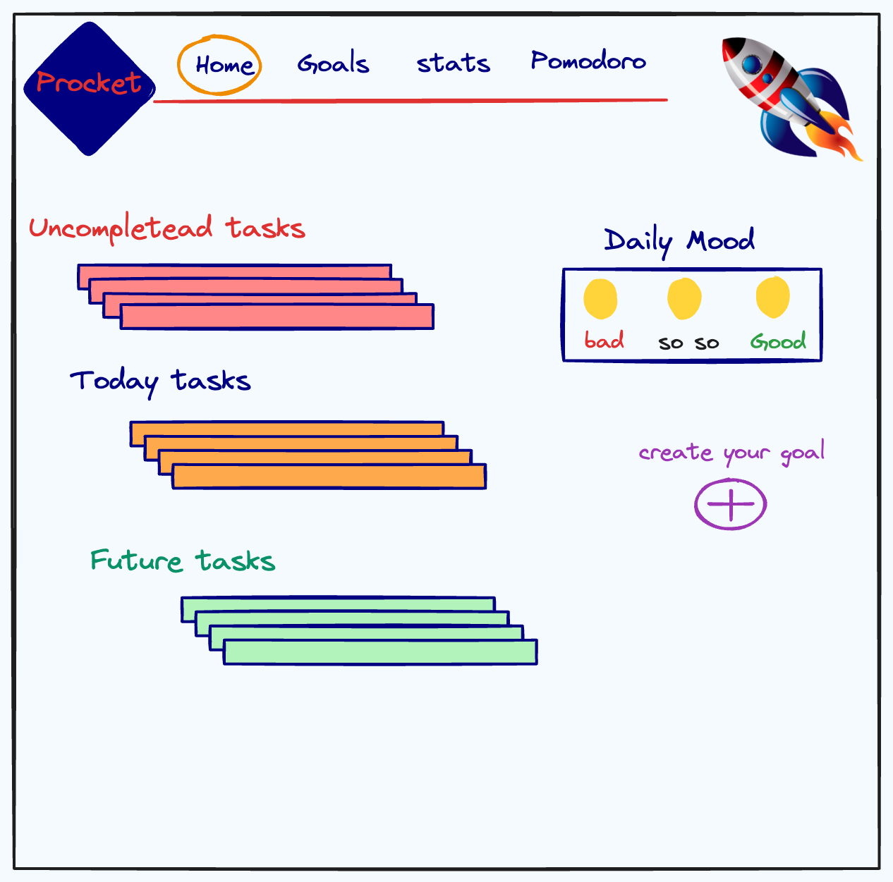
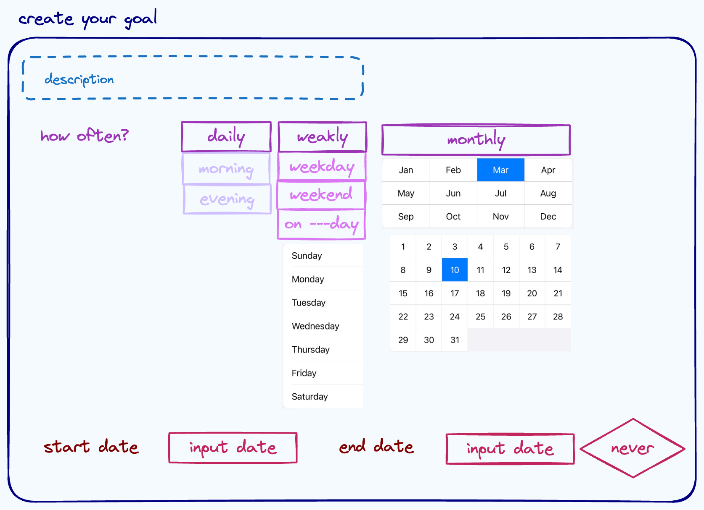
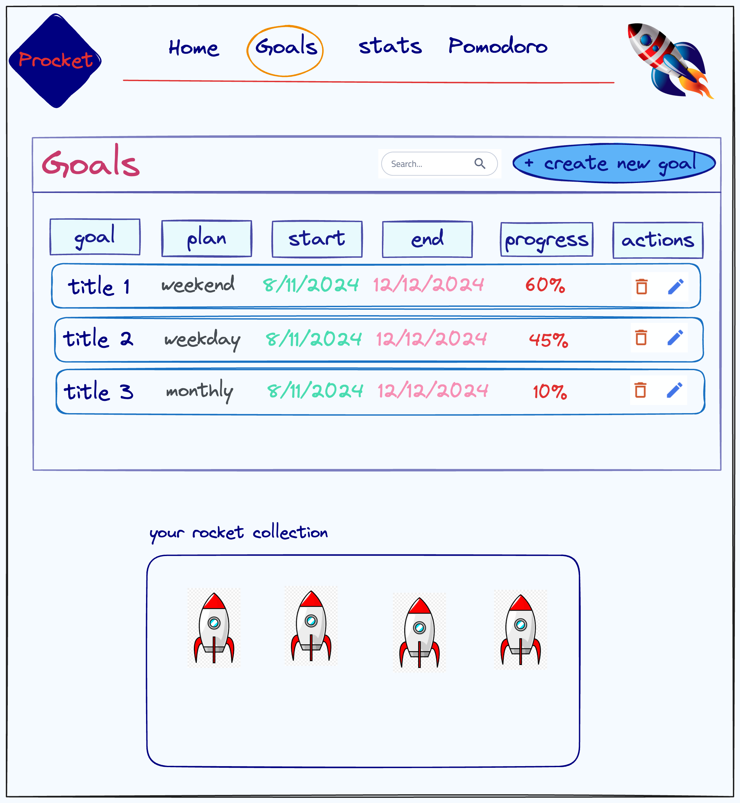
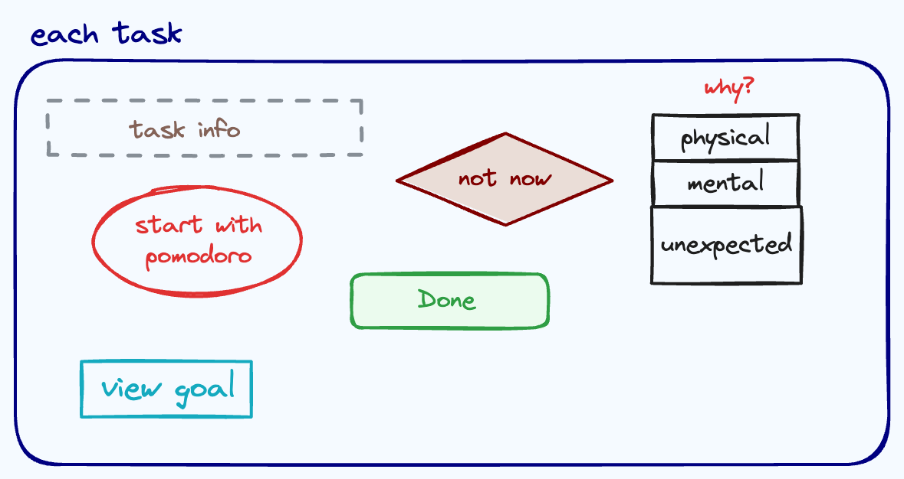
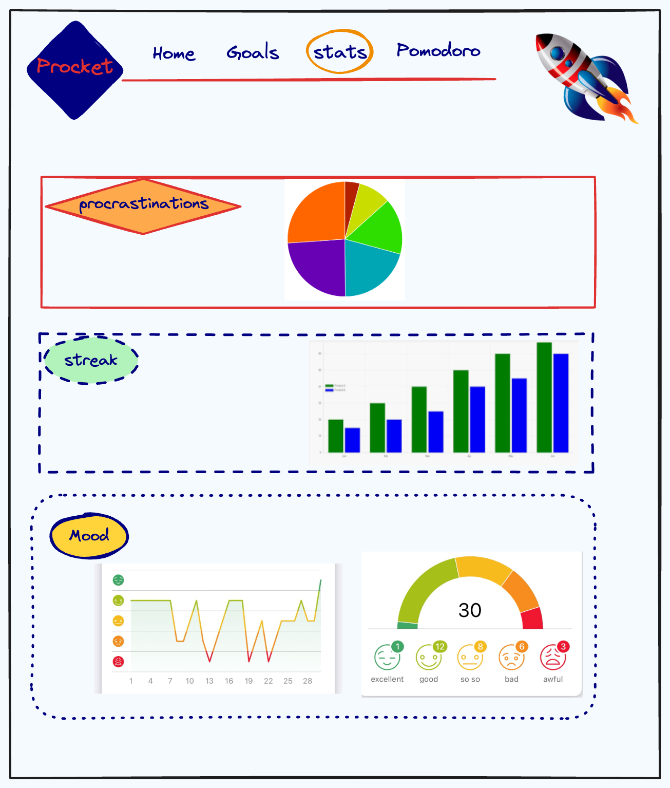
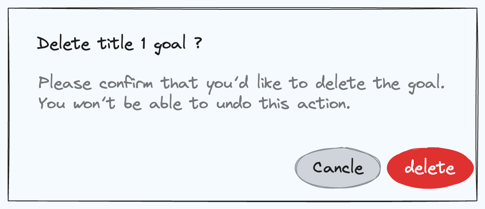
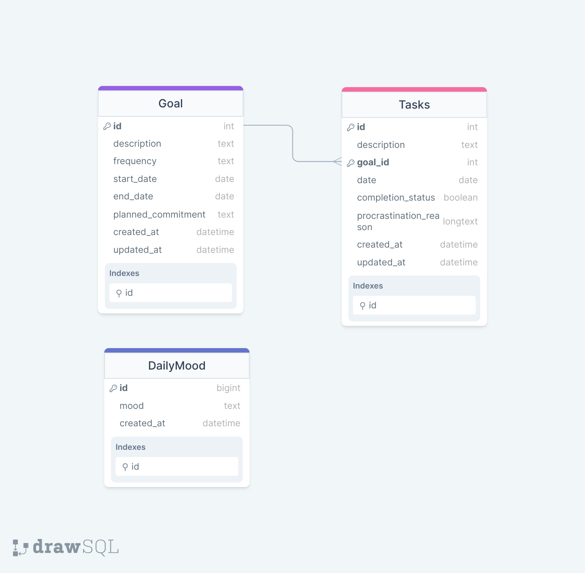

# Project Title
Procket (procrastinating rocket)

## Overview
<!-- What is your app? Brief description in a couple of sentences. -->
Procket is an app designed to help users overcome procrastination and improve productivity by combining a planner and mood tracker with advanced analytics on procrastination patterns.

### Problem
<!-- Why is your app needed? Background information around any pain points or other reasons. -->
Procrastination is a common challenge for many people, leading to missed deadlines, unmet goals, and increased stress. Existing planning apps often lack insights into why tasks are delayed or abandoned, making it difficult for users to improve their productivity.

Procrastination affects up to 20% of the adult population in the United States, leading to decreased productivity, missed deadlines, and increased stress levels (American Psychological Association, APA). Research conducted by Steel and Klingsieck in 2016 has shown that procrastination is associated with poorer performance and well-being outcomes, with individuals experiencing higher levels of stress and anxiety due to the uncertainty and pressure of impending deadlines. Moreover, Pychyl and Flett's study in 2012 suggests that procrastination is often linked to a fear of failure and perfectionism, leading individuals to delay tasks out of concern for not meeting their own high standards or fear of the consequences of potential failure.


Interventions targeting procrastination have been shown to be effective in improving productivity and well-being. Sirois and Pychyl's study in 2013 demonstrated that strategies such as goal setting, time management techniques, and self-monitoring can lead to a reduction in procrastination behavior and improved academic performance. Additionally, incorporating elements of gamification into productivity apps has been found to enhance user engagement and motivation. By turning task completion into a rewarding and visually appealing experience, users are more likely to stay committed to their goals and persist in their efforts to overcome procrastination.

Procket integrates these effective strategies into its design by providing users with customizable goal-setting tools, time management features, and visual progress tracking. By gamifying the task completion process with the metaphor of assembling a rocket, users are incentivized to stay on track and take consistent action towards their goals. Additionally, Procket offers insights into procrastination patterns through advanced analytics, empowering users to identify and address underlying causes of procrastination. By understanding their habits and triggers, users can develop effective strategies to overcome procrastination and maintain momentum towards their goals. Overall, Procket's comprehensive approach to addressing procrastination combines evidence-based strategies with engaging design elements to provide users with an effective solution for improving productivity and achieving their goals."

### User Profile
<!-- Who will use your app? How will they use it? Any special considerations that your app must take into account. -->
Procket is for anyone looking to enhance their productivity and better understand their procrastination habits. Users will create tasks, set goals, track their mood, and analyze procrastination patterns to optimize their planning strategies. The app must consider users' varying levels of tech-savviness and preferences for visual feedback to ensure accessibility and engagement.

### Features
<!-- List the functionality that your app will include. These can be written as user stories or descriptions with related details. Do not describe _how_ these features are implemented, only _what_ needs to be implemented. -->
- Task Creation:
    - Users can create tasks with customizable goals, durations, and reminders.

- Mood Tracking:
    - Users can log their mood daily to correlate emotional states with productivity levels.

- Procrastination Analysis:
    - Advanced analytics provide insights into procrastination patterns over time.

- Progress Graphs:
    - Visualize progress and procrastination trends to make informed planning decisions.

- Daily To-Do List:
    - Generate a daily list of tasks based on predefined goals and priorities.

- Time Management:
    - Set timeframes for tasks and customize Pomodoro sessions for efficient work periods.

- Task Completion:
    - Users can mark tasks as done with checkboxes and provide reasons for any incomplete tasks.

- Prioritize Remaining Tasks:
    vDisplay tasks remaining from previous days to facilitate daily planning.

- Visual Progress Tracking:
    - Rocket assembly metaphor for task completion, visually symbolizing progress towards goals.<br />
    *Procket's visual design aims to reinforce its mission of overcoming procrastination and achieving goals by incorporating imagery of assembling a rocket. Users will encounter a visually engaging interface where completing tasks is represented as assembling small parts of a rocket. Each task completed represents fitting another piece into the rocket body, visually symbolizing progress towards the user's goal. Additionally, upcoming tasks will be visualized as small steps leading to the rocket's launch, reinforcing the idea that commitment to completing these tasks propels the user closer to their target. This visual metaphor serves as a constant reminder of the journey towards productivity and goal achievement, inspiring users to stay committed and focused on their tasks.*


## Implementation
### Tech Stack
<!-- List technologies that will be used in your app, including any libraries to save time or provide more functionality. Be sure to research any potential limitations. -->
- Frontend Framework:
    - **React.js**
    - **react-router**
    - **axios**

- Data Visualization:
    - **Chart.js** - A versatile charting library for creating interactive and customizable charts to visualize progress, procrastination patterns, and mood trends.
    - **React Charts** - Provides React components for integrating Chart.js with React applications, offering seamless integration and enhanced flexibility.
    - **React Circular Progressbar** - Offers customizable circular progress bars for visualizing task completion and goal progress.

- UI Components:
    - **React Slider** - Allows users to set custom timeframes for tasks or adjust settings with intuitive slider components.
    - **React Calendar** - Provides a calendar component for scheduling tasks, setting deadlines, and planning events.
    - **Input Type Date** - Utilizes HTML input types for selecting dates, offering native support and familiarity for users.
    - **Date Range Picker** - Enables users to select date ranges for planning tasks and analyzing productivity over specific time periods.
    - **React Date Picker** - Offers a user-friendly date picker component with customizable options for selecting dates and timeframes.

- UI/UX Design Tools: 
    - Utilize design tools like **Figma** or **excalidraw** for creating wireframes, and UI mockups.

- Backend Framework:
    - **Express.js** (**Node.js**) with **knex**

- Database:
    - Use a relational database like **PostgreSQL** or **MySQL** for storing user data, task information, mood logs, and analytics.

- Authentication:
    - **JSON Web Tokens (JWT)**: A compact, URL-safe means of representing claims to be transferred between two parties, commonly used for secure authentication and authorization.

- Testing:
    **Jest**: A JavaScript testing framework developed by Facebook for unit testing React applications, providing a simple and intuitive testing experience.
    **React Testing Library**: A testing utility for React that encourages best practices for testing user interfaces, focusing on testing components in a way that simulates user behavior.
### APIs
<!-- List any external sources of data that will be used in your app. -->
- No external APIs will be used for the first sprint


### Sitemap
<!-- List the pages of your app with brief descriptions. You can show this visually, or write it out. -->
- Header
   - Procket Logo
   - Navbar: Home, Create Goal, Goals, Statistics

- Home Page
   - Uncompleted Tasks
   - Today's Tasks
   - Future Tasks
   - Daily Mood Tracker

- Create Your Goal Page
   - Goal Description
   - Frequency (Daily, Weekly, Monthly)
   - Start and End Dates
   - Option to Never End

- Task Details Page
   - Task Info
   - Related Goals
   - Pomodoro Timer
   - Mark Task as Done/Delayed

- Goals Page
   - List of Created Goals
     - Goal Name
     - Planned Commitment
     - Start and End Dates
     - Progress Status
     - Actions (Edit, Delete)

- Statistics and Analytics Page
   - Daily Mood Analysis
     - Graph of Daily Mood
   - Procrastination Analysis
     - Patterns and Reasons for Procrastination

   - Navigation to Other Pages (Back Arrow)


### Mockups
#### Home Page

#### Create Goal Page

#### Goals Page

#### Task Details Page

#### Stats Page

#### Delete Goal Popup Modal



### Data
<!-- Describe your data and the relationships between them. You can show this visually using diagrams, or write it out.  -->


### Endpoints
<!-- List endpoints that your server will implement, including HTTP methods, parameters, and example responses. -->
**GET /tasks**
- Retrieve all tasks.
- Response:
    - Status Code: 200 OK
    - Body:
        ```
        [
            {
                "taskId": 1,
                "description": "Complete project proposal",
                "goalId": 1,
                "startDate": "2024-03-20",
                "endDate": "2024-03-25",
                "completionStatus": false,
                "procrastinationReason": null,
                "mood": "Neutral"
            },
            {
                "taskId": 2,
                "description": "Prepare presentation slides",
                "goalId": 1,
                "startDate": "2024-03-22",
                "endDate": "2024-03-24",
                "completionStatus": true,
                "procrastinationReason": null,
                "mood": "Happy"
            }
        ]
        ```

    
**PUT /tasks/{taskId}**
- Update an existing task with following parameters: 
    - taskId (integer): Identifier of the task to update.
    - Any task attributes to update except for *created_at* and *updated_at*.
- Request Body: (Attributes to update)
    ```
    {
        "description": "Research market trends",
        "goalId": 2,
        "date": "2024-03-23",
        "completionStatus": false,
        "procrastinationReason": null,
        "mood": null
    }
    ```
- Response:
    - Status Code: 200 OK
    - Body:
        ```
        {
            "taskId": 3,
            "description": "Research market trends",
            "goalId": 2,
            "date": "2024-03-23",
            "completionStatus": false,
            "procrastinationReason": null,
            "mood": null
        }
        ```

**DELETE /tasks/{taskId}**
- Delete a task with following parameters:
    - taskId (integer): Identifier of the task to delete.
-Response:
    - Status Code: 204 No Content

**GET /goals**
- Retrieve all goals.
- Response:
    - Status Code: 200 OK
    - Body:
        ```
        [
            {
                "goalId": 1,
                "description": "Complete project milestones",
                "frequency": "Weekly",
                "startDate": "2024-03-20",
                "endDate": "2024-04-20",
                "completionStatus": false,
                "plannedCommitment": "High"
            },
            {
                "goalId": 2,
                "description": "Learn new programming language",
                "frequency": "Monthly",
                "startDate": "2024-03-01",
                "endDate": null,
                "completionStatus": true,
                "plannedCommitment": "Medium"
            }
        ]
        ```

**POST /goals**
- Create a new goal with following parameters:
    - description (string): Description of the goal.
    - frequency (string): Frequency of working on the goal (e.g., daily, weekly, monthly).
    - startDate (date): Start date of the goal.
    - endDate (date, optional): End date of the goal (nullable for ongoing goals).
    - plannedCommitment (string): Planned commitment level towards the goal.
- Request Body:
    {
        "description": "Read 10 books by the end of the year",
        "frequency": "Yearly",
        "startDate": "2024-01-01",
        "endDate": "2024-12-31",
        "plannedCommitment": "Medium"
    }
- Response:
    - Status Code: 201 Created
    - Body:
        ```
        {
            "goalId": 3,
            "description": "Read 10 books by the end of the year",
            "frequency": "Yearly",
            "startDate": "2024-01-01",
            "endDate": "2024-12-31",
            "completionStatus": false,
            "plannedCommitment": "Medium"
        }
        ```

**PUT /goals/{goalId}**
- Update an existing goal with following parameters:
    - goalId (integer): Identifier of the goal to update.
    - Any goal attributes to update.
- Request Body: (Attributes to update)
    ```
    {
        "description": "Read 15 books by the end of the year",
        "plannedCommitment": "High"
    }
    ```
- Response:
    - Status Code: 200 OK
    - Body:
        ```
        {
            "goalId": 3,
            "description": "Read 10 books by the end of the year",
            "frequency": "Yearly",
            "startDate": "2024-01-01",
            "endDate": "2024-12-31",
            "completionStatus": false,
            "plannedCommitment": "Medium"
        }
        ```

**DELETE /goals/{goalId}**
- Delete a goal with following parameters:
    - goalId (integer): Identifier of the goal to delete.
- Response:
    - Status Code: 204 No Content

**GET /moods**
- Retrieve all daily moods.
- Response:
    - Status Code: 200 OK
    - Body:
        ```
        [
            {
                "moodId": 1,
                "mood": "Happy"
                "created_at": "2024-03-01"
            },
            {
                "moodId": 2,
                "mood": "Sad",
                "created_at": "2024-03-02"
            }
        ]
        ```

**POST /goals**
- Create a new daily mood with following parameters:
    - mood (string): Title of the mood.
- Request Body:
    ```
    {
        "mood": "Happy"
    }
    ```
- Response:
    - Status Code: 201 Created
    - Body:
        ```
        {
            "moodId": 3,
            "mood": "Happy",
            created_at: "2024-03-03"
        }
        ```


### Error Handling:
The API should provide thorough error handling to guide developers in correcting issues encountered during requests.
For invalid requests or missing parameters, the API will respond with a status code of 400 Bad Request, accompanied by detailed error messages explaining the reason for the failure.
In cases where the requested resource cannot be found, such as attempting to update or delete a nonexistent task or goal, the API will return a status code of 404 Not Found.
Error responses will be designed to be informative, aiding developers in understanding and rectifying the encountered issues effectively.

### Auth
<!-- Does your project include any login or user profile functionality? If so, describe how authentication/authorization will be implemented. -->
No, the project does not include any login or user profile functionality. Authentication and authorization features are not implemented in this version of the app.

## Roadmap
<!-- Scope your project as a sprint. Break down the tasks that will need to be completed and map out timeframes for implementation. Think about what you can reasonably complete before the due date. The more detail you provide, the easier it will be to build. -->
- Setup Development Environment
    - Initialize React project with necessary dependencies and folder structure
    - Set up routing for different pages
    - Create basic boilerplate pages for Home, Task Creation, Mood Tracking Procrastination Analysis, Progress Graphs, and Daily To-Do List

- Set up backend server
    - Initialize Express.js project with routing and middleware setup
    Create placeholder routes with mock responses for tasks and goals endpoints

- Database setup
    - Design the database schema for storing tasks, goals, and user data
    - Set up PostgreSQL or MySQL database with necessary tables and relationships
    - Set up migrations for database changes.
    - Generate seeds with sample data.
    
- Implement CRUD operations for tasks and goals
    - Create endpoints for retrieving, creating, updating, and deleting goals and tasks
    - Implement error handling and status codes for each endpoint to handle invalid requests or missing parameters

- Data visualization
    - Integrate data visualization libraries such as Chart.js to create interactive graphs and charts for visualizing progress, procrastination patterns, and mood trends
    - Design and implement UI components for displaying visualizations

- Frontend Feature Branches:

    - task-creation-page:
        - Implement UI components and functionality for creating tasks.
        - Includes form inputs for task description, goals, start/end dates, and reminders.

    - mood-tracking-page:
        - Develop UI components and logic for logging daily mood.
        - Implement mood selection options and store mood data.

    - procrastination-analysis-page:
        - Integrate data visualization libraries to display procrastination patterns.
        - Create UI components to visualize procrastination trends over time.

    - progress-graphs-page:
        - Implement UI components for displaying progress graphs.
        - Utilize Chart.js or similar libraries to visualize task completion and goal progress.

    - daily-to-do-list-page:
        - Develop UI components for generating daily to-do lists.
        - Display tasks based on predefined goals and priorities.

    - time-management
        - Implement time management features such as setting task timeframes and customizing Pomodoro sessions.
        - Integrate React components for managing countdowns and Pomodoro sessions effectively.

    - visual-progress-tracking:
        - Develop UI components for visual progress tracking using a rocket assembly metaphor.
        - Implement visual elements to symbolize task completion and progress towards goals.

- Backend Feature Branches:

    - task-endpoints:
        - Implement CRUD operations for tasks endpoints (/tasks).
        - Develop controllers and services for retrieving, creating, updating, and deleting tasks.

    - goal-endpoints:
        - Implement CRUD operations for goals endpoints (/goals).
        - Create controllers and services for managing goals data.

    - data-visualization:
        - Set up routes and controllers for retrieving data for visualization.
        - Ensure data retrieval endpoints are optimized for efficient visualization rendering.

    - error-handling:
        - Implement error handling middleware to handle invalid requests and internal server errors.
        - Ensure consistent error responses are returned for different scenarios.

    - database-setup:
        - Set up database connections and migrations for creating tables and relationships.
        - Ensure database schema aligns with application requirements.

    - integration-testing:
        - Write integration tests for endpoints to ensure proper functionality and data integrity.
        - Test CRUD operations and error handling scenarios.

    - deployment-setup:
        - Configure deployment settings for deploying the backend server.
        - Choose a suitable hosting platform and set up deployment pipelines if applicable.

- Bug fixes

- DEMO DAY

## Nice-to-haves
<!-- Your project will be marked based on what you committed to in the above document. Under nice-to-haves, you can list any additional features you may complete if you have extra time, or after finishing. -->

- Dark Theme:
    - Implement a dark theme option for the app's interface, providing users with a visually appealing alternative and reducing eye strain during nighttime usage.

- Authentication and User Profile:
    - Integrate authentication functionality to allow users to create accounts, log in securely, and manage their profiles. This feature enhances security and personalization within the app.

- Pomodoro Technique Page:
    - Create a dedicated Pomodoro page where users can utilize the Pomodoro technique to enhance their productivity. This feature includes timers for work periods and breaks, helping users stay focused and manage their time effectively.

- Independent Tasks:
    - Enable users to add independent tasks that are not related to specific goals. Upon completing these tasks, visualize their achievement with a dart icon 🎯, providing a sense of accomplishment and progress.

- Calendar View:
    - Implement a calendar view displaying scheduled tasks, deadlines, and events.
    This feature allows users to visualize their plans and manage their schedules effectively, enhancing organization and productivity.

- About Us Page:
    - Create an About Us page providing a clear and concise description of the insight behind the app. Explain the facts about procrastination and how the app approaches solving it, helping users understand the purpose and mission of the app.

- Goal Planning and Realistic Expectations:
    - Provide guidance on setting realistic goals and managing expectations based on the user's history of procrastination and productivity. Utilize insights from the app's analytics to offer personalized recommendations, helping users overcome perfectionism and stress.