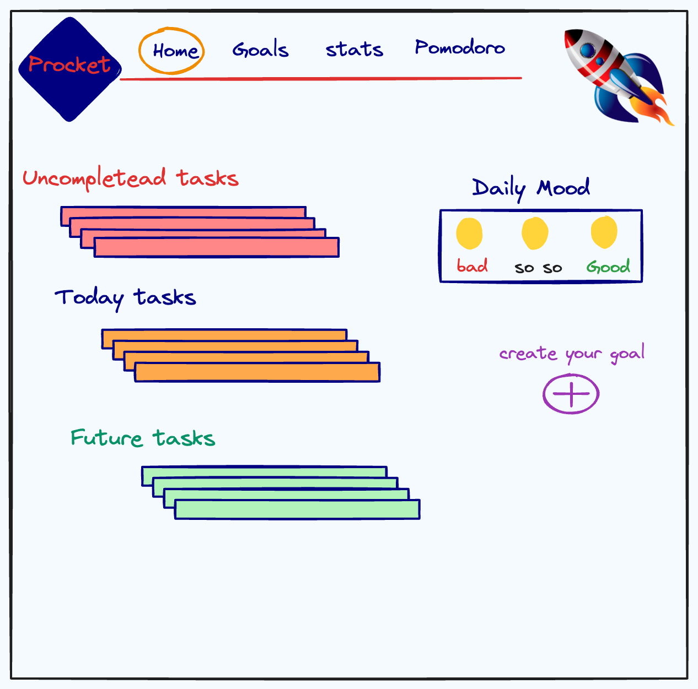
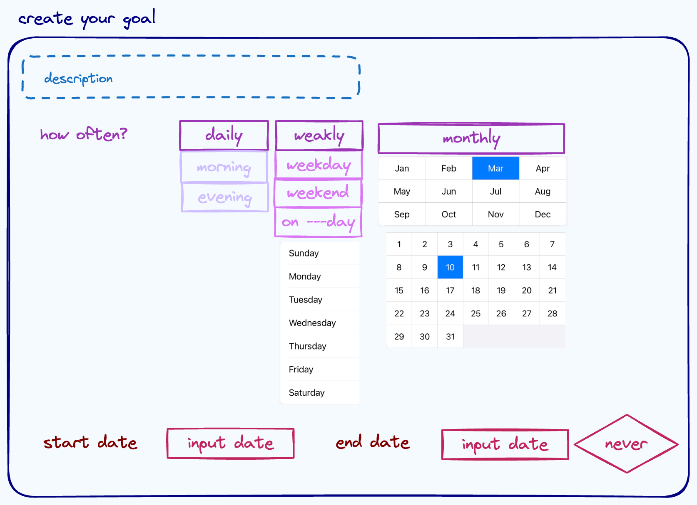
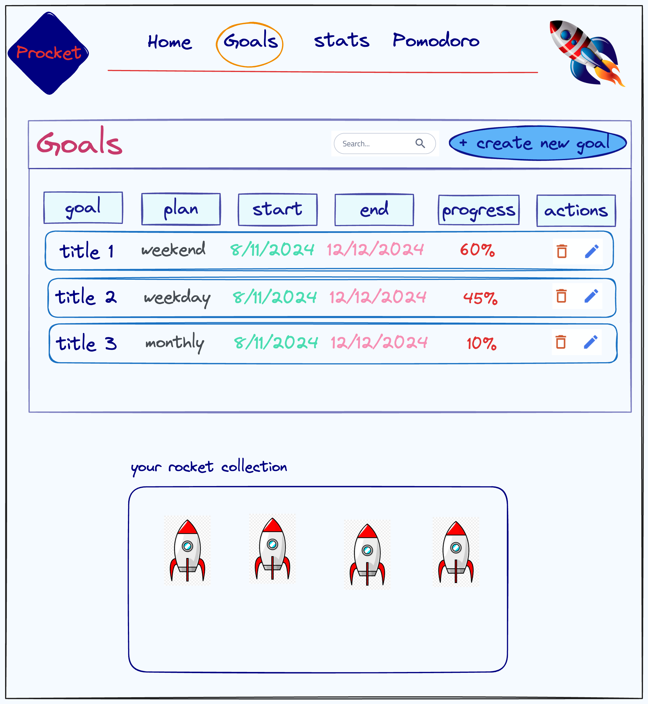
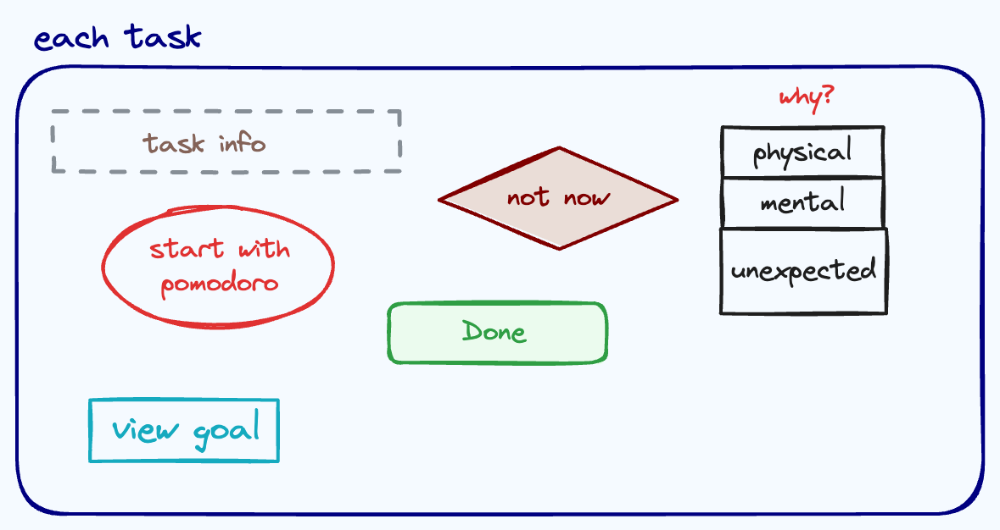
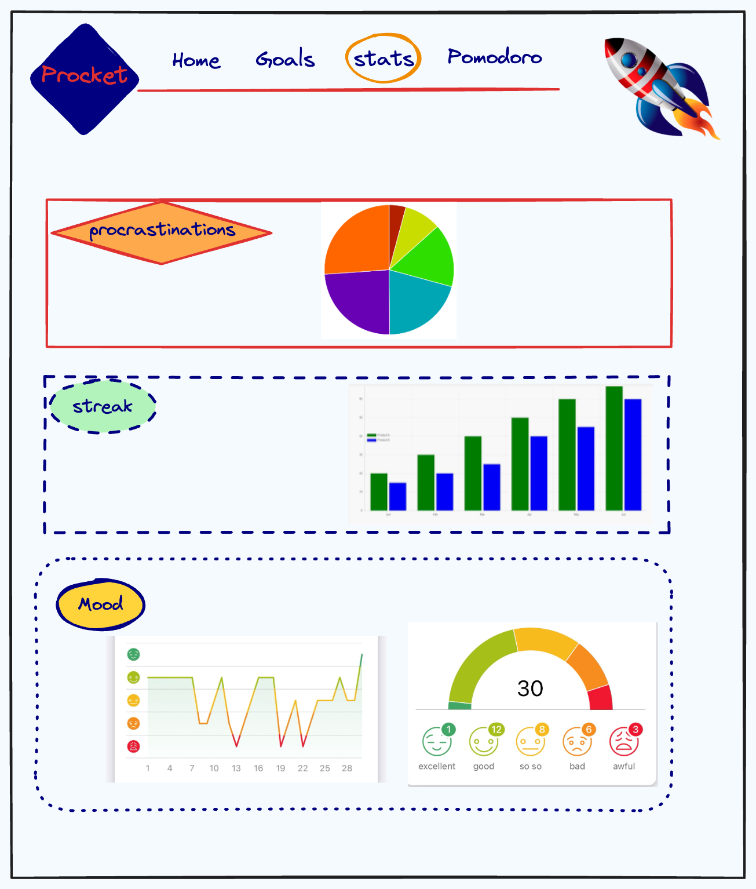
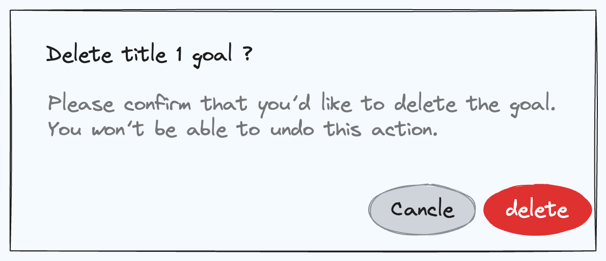
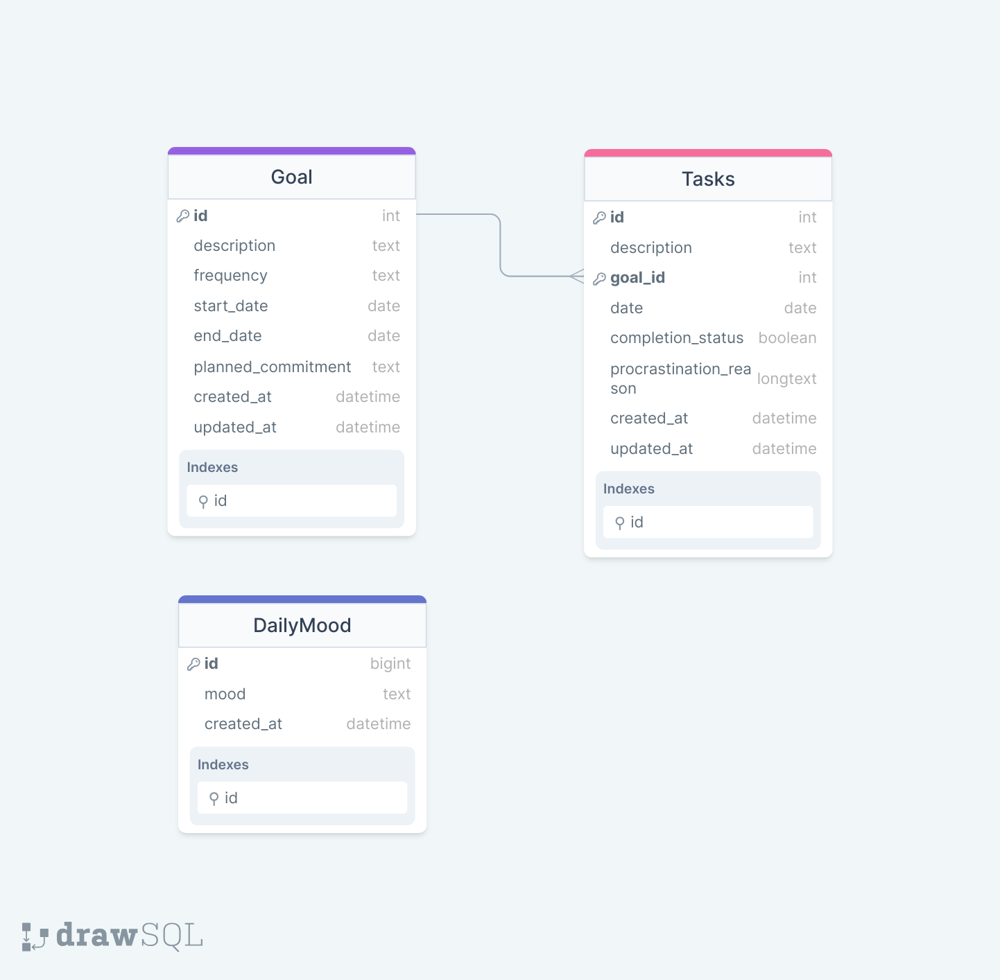

# How to install Project

- after clone behina-bahramsari-procket-api repo:

  - npm install
  - create a .env like the sample provided
  - npx knex migrate:latest
  - npx knex seed:run
  - npm run start

- after clone behina-bahramsari-procket repo:
  - npm install
  - npm start

# Project Title

Procket (procrastinating rocket)

## Overview

Procket is an app designed to help users overcome procrastination and improve productivity by combining a planner and mood tracker with advanced analytics on procrastination patterns.

### Problem

Procrastination is a common challenge for many people, leading to missed deadlines, unmet goals, and increased stress. Existing planning apps often lack insights into why tasks are delayed or abandoned, making it difficult for users to improve their productivity.

Procrastination affects up to 20% of the adult population in the United States, leading to decreased productivity, missed deadlines, and increased stress levels (American Psychological Association, APA). Research conducted by Steel and Klingsieck in 2016 has shown that procrastination is associated with poorer performance and well-being outcomes, with individuals experiencing higher levels of stress and anxiety due to the uncertainty and pressure of impending deadlines. Moreover, Pychyl and Flett's study in 2012 suggests that procrastination is often linked to a fear of failure and perfectionism, leading individuals to delay tasks out of concern for not meeting their own high standards or fear of the consequences of potential failure.

Interventions targeting procrastination have been shown to be effective in improving productivity and well-being. Sirois and Pychyl's study in 2013 demonstrated that strategies such as goal setting, time management techniques, and self-monitoring can lead to a reduction in procrastination behavior and improved academic performance. Additionally, incorporating elements of gamification into productivity apps has been found to enhance user engagement and motivation. By turning task completion into a rewarding and visually appealing experience, users are more likely to stay committed to their goals and persist in their efforts to overcome procrastination.

Procket integrates these effective strategies into its design by providing users with customizable goal-setting tools, time management features, and visual progress tracking. By gamifying the task completion process with the metaphor of assembling a rocket, users are incentivized to stay on track and take consistent action towards their goals. Additionally, Procket offers insights into procrastination patterns through advanced analytics, empowering users to identify and address underlying causes of procrastination. By understanding their habits and triggers, users can develop effective strategies to overcome procrastination and maintain momentum towards their goals. Overall, Procket's comprehensive approach to addressing procrastination combines evidence-based strategies with engaging design elements to provide users with an effective solution for improving productivity and achieving their goals."

### User Profile

Procket is for anyone looking to enhance their productivity and better understand their procrastination habits. Users will create tasks, set goals, track their mood, and analyze procrastination patterns to optimize their planning strategies. The app must consider users' varying levels of tech-savviness and preferences for visual feedback to ensure accessibility and engagement.

### Features

- Goal and Task Creation:

  - Users can create goals with start and end date and also create associated tasks with specific due dates.

- Goal and Task Managmant:

  - Users can edit and delete goals also create associated tasks with specific due dates.

- Task Completion:

  - Users can mark tasks as done with checkboxes also revert it.

- Task Postpone with reason :

  - Users can postpone a task with providing a reason and new due date.

- To-Do List:

  - Generate a list of tasks based on due date priorities.

- Remaining Uncompleted Tasks:

  - Display uncompleted tasks remaining from past days to facilitate daily planning.

- Procrastination Analysis:

  - Advanced analytics provide insights into procrastination patterns over time.

- Progress Graphs:

  - Visualize progress and procrastination trends for each goal to make informed planning decisions.

- Visual Progress Tracking and Rewards:
  - Upon completing a goal, a rocket is assembled with parts representing completed tasks and launched. Also an appealing rocket is added to the collection as a visual award, symbolizing progress and encouraging users.

## Implementation

### Tech Stack

- Frontend Framework:

  - **React.js**
  - **react-router**
  - **axios**

- UI Components and Data Visualization:

  - **Input Type Date** - Utilizes HTML input types for selecting dates, offering native support and familiarity for users.
  - **React Google Charts** - Provides a library for creating interactive and visually appealing charts, enhancing data visualization capabilities

- UI/UX Design Tools:

  - Utilize design tools like **excalidraw** for creating wireframes, and UI mockups.

- Backend Framework:

  - **Express.js** (**Node.js**) with **knex** for database operations.

- Database:

  - Use a relational database **MySQL** for goals and tasks information, procrastinations logs.

- Project Managment:
  - **Jira**: Tracks task progress and manages branch names with Kanban.

### APIs

- No external APIs will be used for the first sprint

### Sitemap

- Header

  - Procket Logo
  - Navbar: Home, Goals, tasks, Statistics

- Home Page

  - Daily Mood Tracker (Future Future)
  - Create New Goal, New Task
  - Ongoing Tasks
  - Past Tasks

- Goals Page

  - List of Created Goal
    - Navigation to Goal Details page (Forward Arrow)
    - Goal Description
    - Start and End Dates
    - Progress %
    - Delete Action
  - Create New Goal
  - Rocket Collection

- Goal Details page

  - Navigation to Goals Pages (Back Arrow)
  - Edit Goal Description, Start and End Dates, Progress
  - Create New Task
  - List of Associated Tasks
    - Task Description
    - Due Dates
    - Done, Postpone, Delete Action

- Tasks Page

  - Create New Task
  - List of Created Goal
    - Navigation to Task Details page (Forward Arrow)
    - Task Description
    - Related Goals
      - Navigation to Related Goal Detail page (Clickable Link)
    - Due Date
    - Done/Postpone Action
    - Delete Action

- Task Details Page

  - Navigation to Tasks Pages (Back Arrow)
  - Edit Task Description, Due Dates
  - Done Action
  - Postpone Action and Create New Procrastination with new due date
  - List of Associated Procrastinations
    - Procrastination reason
    - Created at Date
    - Delete Action

- Statistics Page

  - Procrastination Distribution
    - Pie Chart displaying total count of each procrastination reasons
  - Goals Procrastination Analysis
    - Line Chart displaying patterns of procrastination reasons
  - Per Goal Procrastination Analysis
    - Column Chart displaying count of procrastination reasons of each goal
  - Goals Progress Analysis
    - Bar Chart displaying patterns of progress

- Footer

  - copy right message
  - about us (Future Future)

### Mockups

#### Home Page



#### Create Goal Page



#### Goals Page



#### Task Details Page



#### Stats Page



#### Delete Goal Popup Modal



### Data



### Endpoints

**Base URL**

- http://localhost:5001/api

**GET /goals**

- Retrieve all goals sorted in ascending order, first by their progress percentage, and then, in case of a tie, by their end date.
- Response:
  - Status Code: 200 OK
  - Body:
    ```
    [
        {
            "id": 3,
            "description": "Learn French",
            "start_date": "2024-03-01",
            "end_date": "2024-03-31",
            "progress": 0,
            "procastinations": 2
        },
        {
            "id": 2,
            "description": "Read 5 books",
            "start_date": "2024-03-01",
            "end_date": "2024-03-31",
            "progress": 40,
            "procastinations": 5
        }
    ]
    ```

**POST /goals**

- Create a new goal with following parameters:
  - description (string): Description of the goal.
  - startDate (date): Start date of the goal.
  - endDate (date): End date of the goal.
- Request Body:
  {
  "description": "New Goal for test",
  "start_date": "2024-04-06",
  "end_date": "2024-04-12"
  }
- Response:
  - Status Code: 201 Created
  - Body:
    ```
    {
        "id": 33,
        "description": "New Goal for test",
        "start_date": "2024-04-06",
        "end_date": "2024-04-12",
        "progress": 0
    }
    ```

**GET /goals/{goalId}**

- Retrieve a specific goal with given goalId like 1.
- Response:
  - Status Code: 200 Created
  - Body:
    ```
    {
        "id": 1,
        "description": "Finish Procket project",
        "start_date": "2024-03-18",
        "end_date": "2024-04-06",
        "progress": 66.67
    }
    ```

**PUT /goals/{goalId}**

- Update an existing goal with following parameters:
  - goalId (integer): Identifier of the goal to update.
  - Any goal attributes to update.
- Request Body: (Attributes to update)
  ```
    {
        "description": "Update New Goal for test",
        "start_date": "2024-04-15",
        "end_date": "2024-04-30"
    }
  ```
- Response:
  - Status Code: 200 OK
  - Body:
    ```
    {
        "id": 33,
        "description": "Update New Goal for test",
        "start_date": "2024-04-15",
        "end_date": "2024-04-30",
        "progress": 0
    }
    ```

**DELETE /goals/{goalId}**

- Delete a goal with following parameters:
  - goalId (integer): Identifier of the goal to delete.
- Response:
  - Status Code: 204 No Content

**GET /goals/{goalId}/tasks**

- Retrieve all procrastinations coont associated with a specific goal (goalId: 1).
- Response:
  - Status Code: 200 OK
  - Body:
    ```
    [
        {
            "id": 7,
            "goal_id": 1,
            "description": "Implement authentication feature",
            "is_completed": 0,
            "due_date": "2024-04-01",
            "procastinations": 3
        },
        {
            "id": 1,
            "goal_id": 1,
            "description": "Complete frontend development",
            "is_completed": 1,
            "due_date": "2024-04-06",
            "procastinations": 3
        }
    ]
    ```

**GET /goals/{goalId}/procrastinations**

- Retrieve all procrastinations associated with a specific goal (goalId: 1), sorted by ascending due date. Upcoming due dates are displayed first, followed by past ones.
- Response:
  - Status Code: 200 OK
  - Body:
    ```
    {
        "No rush, plenty of time": 1,
        "Forgetting": 3,
        "Not being in the mood": 1,
        "Delaying one task to perfect another": 1,
        "Sickness or poor health": 1
    }
    ```

**GET /tasks**

- Retrieve all tasks sorted by ascending due date, starting with upcoming tasks followed by past ones.
- Response:
  - Status Code: 200 OK
  - Body:
    ```
    [
        {
            "id": 11,
            "goal_id": 3,
            "goal_description": "Learn French",
            "description": "Watch French movies with subtitles",
            "is_completed": 0,
            "due_date": "2024-03-20"
        },
        {
            "id": 8,
            "goal_id": 2,
            "goal_description": "Read 5 books",
            "description": "Read 'The Great Gatsby' by F. Scott Fitzgerald",
            "is_completed": 0,
            "due_date": "2024-03-25"
        },
    ]
    ```

**POST /tasks**

- Create a new task with following parameters:
  - goalId (integer): Identifier of the associated goal.
  - description (string): Description of the task.
  - due_date(date): Due date of the task.
- Request Body:
  ```
  {
      "goal_id": "33",
      "description": "New task for test",
      "due_date": "2024-04-18",
  }
  ```
- Response:
  - Status Code: 201 Created
  - Body:
    ````
    {
        "id": 45,
        "goal_id": 33,
        "goal_description": "Update New Goal for test",
        "description": "New task for test",
        "is_completed": 0,
        "due_date": "2024-04-18"
    }
    ```
    ````

**GET /tasks/past**

- Retrieve all tasks which is later than todaypast ones..
- Response:
  - Status Code: 200 OK
  - Body:
    ```
    {
        "id": 11,
        "goal_id": 3,
        "goal_description": "Learn French",
        "description": "Watch French movies with subtitles",
        "is_completed": 0,
        "due_date": "2024-03-20"
    },
    {
        "id": 8,
        "goal_id": 2,
        "goal_description": "Read 5 books",
        "description": "Read 'The Great Gatsby' by F. Scott Fitzgerald",
        "is_completed": 0,
        "due_date": "2024-03-25"
    },
    ```

**GET /tasks/on-going**

- Retrieve a specific goal with given goalId like 1.
- Response:
  - Status Code: 200 Created
  - Body:
    ```
    [
    {
        "id": 7,
        "goal_id": 1,
        "goal_description": "Finish Procket project",
        "description": "Implement authentication feature",
        "is_completed": 0,
        "due_date": "2024-04-01"
    }
    ]
    ```

**GET /tasks/{taskId}**

- Retrieve a specific task with given taskId like 1.
- Response:
  - Status Code: 200 Created
  - Body:
    ```
    {
        "id": 1,
        "goal_id": 1,
        "goal_description": "Finish Procket project",
        "description": "Complete frontend development",
        "is_completed": 1,
        "due_date": "2024-04-06"
    }
    ```

**PUT /tasks/{taskId}**

- Update an existing task with following parameters:
  - taskId (integer): Identifier of the task to update like 33
  - Any task attributes to update except for _created_at_ and _updated_at_.
- Request Body:
  ```
  {
      "description": "Update New task for test",
      "due_date": "2024-04-19",
      "is_completed": 1
  }
  ```
- Response:
  - Status Code: 201 Created
  - Body:
    ````
    {
        "id": 45,
        "goal_id": 33,
        "goal_description": "Update New Goal for test",
        "description": "Update New task for test",
        "is_completed": 1,
        "due_date": "2024-04-19"
    }
    ```
    ````

**DELETE /tasks/{taskId}**

- Delete a task with following parameters:
  - taskId (integer): Identifier of the task to delete.
- Response:
  - Status Code: 204 No Content

**GET /tasks/{taskId}/procrastinations**

- Retrieve list of associated procrastinations of a specific task with given taskId like 1 .
- Response:

  - Status Code: 200 OK
  - Body:

    ```
    [
        {
            "id": 1,
            "task_id": 1,
            "reason": "No rush, plenty of time",
            "created_at": "2024-04-01 00:05:03"
        },
        {
            "id": 2,
            "task_id": 1,
            "reason": "Forgetting",
            "created_at": "2024-04-01 00:05:03"
        },
    ]
    ```

    **GET /tasks/{taskId}/procrastinations/grouped**

- Retrieve total associated procrastinations reason count of a specific task with given taskId like 1 .
- Response:
  - Status Code: 200 OK
  - Body:
    ```
    {
        "No rush, plenty of time": 1,
        "Forgetting": 1,
        "Not being in the mood": 1
    }
    ```

**POST /procrastinations**

- Create a new procrastinations with following parameters:
  - task_id (string): associated task id .
  - reason (string): one of the following opsions ("Not being in the mood", "No rush, plenty of time", "Nothing bad will happen", "No motivation", "Forgetting", "Sickness or poor health", "Overthinking the task", "Delaying one task to perfect another")
- Request Body:
  ```
  {
      "task_id":"45" ,
      "reason": "Forgetting"
  }
  ```
- Response:
  - Status Code: 201 Created
  - Body:
    ```
    {
        "id": 31,
        "task_id": 45,
        "reason": "Forgetting",
        "created_at": "2024-04-01 11:40:13"
    }
    ```

**Get /procrastinations/grouped**

- Retrieve all procrastinations reason count.
- Response:
  - Status Code: 200 OK
  - Body:
    ```
    {
        "No rush, plenty of time": 2,
        "Forgetting": 6,
        "Not being in the mood": 5,
        "Sickness or poor health": 4,
        "Nothing bad will happen": 3,
        "Overthinking the task": 2,
        "Delaying one task to perfect another": 2
    }
    ```

**DELETE /procrastinations/{procrastinationId}**

- Delete a task with following parameters:
  - procrastinationId (integer): Identifier of the associate procrastination to delete.
- Response:
  - Status Code: 204 No Content

**Get /rockets**

- Retrieve all rockets image based on the number of completed goals .
- Response:
  - Status Code: 200 OK
  - Body:
    ```
    [
        "images/rocket-1.png",
        "images/rocket-2.png"
    ]
    ```

### Auth

No, the project does not include any login or user profile functionality. Authentication and authorization features are not implemented in this version of the app.

## Roadmap

- Jira for this project explain road map with more details:

  - [Jira Procket](https://procket.atlassian.net/jira/software/projects/PRO/boards/1/backlog?atlOrigin=eyJpIjoiZjJkNWRiYzdmOTg1NDRkM2IxZGYwMDViZjE2NDVjNDYiLCJwIjoiaiJ9)

- Setup frontend

  - Initialize React project with necessary dependencies and folder structure
  - Set up routing and basic boilerplate for different pages

- Setup backend server

  - Initialize Express.js project with routing and middleware setup
  - Create placeholder routes with mock responses for tasks and goals endpoints

- Setup Database

  - Design the database schema for tasks, goals, procrastinations
  - Set up MySQL database with necessary tables and relationships
  - Set up migrations with knex
  - Generate seeds with sample data
  - Implement CRUD operations = Create endpoints for retrieving, creating, updating, and deleting in each controller and route

- Setup Backend Endpoints

  - GET /goals
    - Retrieve all goals sorted by ascending progress percentage used in Goals page.
  - POST /goals
    - Create a new goal used in New Goal page.
  - GET /goals/{goalId}
    - Retrieve a specific goal used in Goal Details page.
  - PUT /goals/{goalId}
    - Update an existing goal used in Edit Goal page.
  - DELETE /goals/{goalId}
    - Delete a goal.
  - GET /goals/{goalId}/tasks
    - Retrieve all tasks associated with a specific goal used in Goal Details page.
  - GET /goals/{goalId}/procrastinations
    - Retrieve all procrastinations associated with a specific goal used in Stats page.
  - GET /tasks
    - Retrieve all tasks sorted by ascending due date used in Tasks.
  - POST /tasks
    - Create a new task used in New Task page.
  - GET /tasks/{taskId}
    - Retrieve a specific task used in Task Details page.
  - PUT /tasks/{taskId}
    - Update an existing task used in Edit Task page.
  - DELETE /tasks/{taskId}
    - Delete a task.
  - GET /tasks/{taskId}/procrastinations
    - Retrieve all procrastinations associated with a specific task used in Stats page.
  - POST /procrastinations
    - Create a new procrastination used in Task Details page.
  - GET /procrastinations/grouped
    - Retrieve all procrastinations reason count used in Stats page.
  - DELETE /procrastinations/{procrastinationId}
    - Delete a procrastination.

- Setup Backend Validators

  - Goals validator
    - Validate Required Fields
      - Ensure the presence of required fields (description, start_date, and end_date) in the request body.
      - If any of these fields are missing or empty, it returns a 400 status code with a corresponding error message.
    - Prevents Duplicate Goals:
      - if a goal with the same description, start date, and end date already exists in the database:
        - If it does and the validation is for an update operation, it allows the update.
        - For creating a new goal, return a 409 status code indicating a conflict.
  - Tasks validatore
    - Validate Required Fields
      - Ensure the presence of required fields (description and due_date) in the request body.
      - If any of these fields are missing or empty, return a 400 status code with a corresponding error message.
    - Check Goal Existence:
      - Verify if the specified goal_id exists in the database.
      - If the goal does not exist, return a 404 status code with an error message.
    - Prevent Duplicate Tasks:
      - Check if a task with the same description and due_date already exists for the specified goal_id.
      - If it exists:
        - For update operations, allow the update.
        - For creating a new task, return a 409 status code indicating a conflict.
    - Validate Due Date:
      - Ensure that the due date of the task falls within the start and end dates of the associated goal.
      - If the due date is outside the goal's timeframe, return a 400 status code with an error message.

- Feature: Header

  - Implement header component with Procket logo and navigation bar
  - Link navigation bar items to corresponding pages

- Feature: Footer

  - Implement copyright message
  - Implement link to About Us page (Future Feature)

- Feature: Task Details Page

  - Implement navigation back to Tasks Page
  - Enable editing of task description and due dates:
    - Implement forms and UI elements for editing task details
    - Implement API calls to update task details in the backend
  - Implement actions for marking task as done, postponing which follow by creating new procrastination with new due date:
    - Add UI elements/buttons for marking task as done, postponing
    - Implement corresponding API calls to update task status and create new procrastinations in the backend
  - Display list of associated procrastinations with action for deletion:
    - Fetch and display procrastinations associated with the current task
    - Provide options for deleting procrastinations from the UI

- Feature: Tasks Page

  - Implement creation of new tasks:
    - Create a form for adding new tasks
    - Implement API call to create new tasks in the backend
  - Display list of created tasks:
    - Implement API call to fetch tasks data from the backend
    - Display tasks in a list/grid format
  - Implement navigation to task details page:
    - Add clickable forward arrow to each task item that lead to the task details page
  - Display associated goals with navigation links:
    - Display goals associated with each task as clickable links that lead to the goal details page
  - Implement actions for marking tasks as done, postponing, and deleting:
    - Add UI buttons for marking tasks as done, postponing, deleting
    - Implement corresponding API calls to update task status and delete tasks in the backend

- Feature: Goal Details Page

  - Implement navigation back to Goals Page
  - Enable editing of goal description, start and end dates:
    - Implement forms and UI elements for editing goal details
    - Implement API calls to update goal details in the backend
  - Implement creation of new tasks associated with the goal:
    - Create a form for adding new tasks associated with the current goal
    - Implement API call to create new tasks associated with the goal in the backend
  - Display list of associated tasks with actions for marking task as done, postponing and deletion:
    - Fetch and display tasks associated with the current goal
    - Provide actions buttons from the UI
  - Display visual goal completation to award 100% progress:
    - Develop UI animation to enhance user experience with smooth transitions and responsive in all devices
    - Implement visual elements to symbolize task completion rocket assembly
    - Award goals completion as successfully launching the rocket

- Feature: Goals page

  - Display list of created goals:
    - Implement API call to fetch goals data from the backend
    - Display all created goals in a table sorted by their progress with delete action functionality.
  - Implement navigation to goal details page:
    - Add clickable forward arrow to each goal item that lead to the goal details page
  - Design and implement creation of new goals:
    - Create a form for adding new goals with validation
    - Implement API call to create new goals in the backend
  - Implement rocket collection:
    - Display collected rockets images based on user's completed goals

- Feature: Stats page

  - Implement Procrastination Distribution with a pie chart displaying total count of each procrastination reason:
    - Integrate data visualization gogole react chart library to render the pie chart
    - Fetch data from the backend and format it for the pie chart
  - Implement Goals Procrastination Analysis with a line chart displaying patterns of procrastination reasons:
    - Integrate data visualization gogole react chart library to render the line chart
    - Fetch data from the backend and format it for the line chart
  - Implement Per Goal Procrastination Analysis with a column chart displaying count of procrastination reasons for each goal:
    - Integrate data visualization gogole react chart library to render the column chart
    - Fetch data from the backend and format it for the column chart
  - Implement Goals Progress Analysis with a bar chart displaying patterns of progress:
    - Integrate data visualization gogole react chart library to render the bar chart
    - Fetch data from the backend and format it for the bar chart

- Feature: Home Page

  - Design UI for Daily Mood Tracker (Future Feature)
  - Implement functionality to create new goals and tasks:
    - Implement forms for adding new goals and tasks
    - by using POST /goals and POST /tasks
  - Fetch and display ongoing and past tasks:

    - Implement API call to fetch ongoing and past tasks data from the backend
    - Display ongoing and past tasks sort by their due date without showing the completed ones

  - tasks-endpoints:

    - Implement CRUD operations for tasks endpoints (/tasks).
    - Develop controllers and services for retrieving, creating, updating, and deleting tasks.

  - goals-endpoints:

    - Implement CRUD operations for goals endpoints (/goals).
    - Create controllers and services for managing goals data.

  - data-visualization:

    - Set up routes and controllers for retrieving data for visualization.
    - Ensure data retrieval endpoints are optimized for efficient visualization rendering.

  - error-handling:

    - Implement error handling middleware to handle invalid requests and internal server errors.
    - Ensure consistent error responses are returned for different scenarios.

  - Implement validation for each endpoint to handle valid response and request
  - Implement error handling and status codes for each endpoint to handle invalid requests or missing parameters

- Bug fixes

- DEMO DAY

## Nice-to-haves

- About Us Page:

  - Create an About Us page providing a clear and concise description of the insight behind the app. Explain the facts about procrastination and how the app approaches solving it, helping users understand the purpose and mission of the app.

- Mood Tracking:

  - Users can log their mood daily to correlate emotional states with productivity levels.

- Time Management:

  - Set timeframes for tasks inaddition to date and display tasks in a timeline frame.

- Prioritize Tasks and goals with flag:

  - Display tasks and goals based on the priority to facilitate planning.

- Sort functionality :

  - Sort goals and task in tables.

- Search functionality :

  - Find spesific keyword or date in all pages.

- Reminder :

  - Based on duedate sen notification to user to remind them their tasks.

- Color Theme:

  - Implement a customizable theme option for the app's interface, providing users with a visually appealing alternative.

- Authentication and User Profile:

  - Integrate authentication functionality to allow users to create accounts, log in securely, and manage their profiles. This feature enhances security and personalization within the app.

- Pomodoro Technique Page:

  - Create a dedicated Pomodoro page where users can utilize the Pomodoro technique to enhance their productivity. This feature includes timers for work periods and breaks, helping users stay focused and manage their time effectively.

- Independent Tasks:

  - Enable users to add independent tasks that are not related to specific goals. Upon completing these tasks, visualize their achievement with a dart icon 🎯, providing a sense of accomplishment and progress.

- Calendar View:

  - Implement a calendar view displaying scheduled tasks, deadlines, and events.

- Goal Planning and Realistic Expectations:

  - Provide guidance on setting realistic goals and managing expectations based on the user's history of procrastination and productivity. Utilize insights from the app's analytics to offer personalized recommendations, helping users overcome perfectionism and stress.

- Testing:

  - Write integration tests for endpoints to ensure proper functionality and data integrity.
  - Test CRUD operations and error handling scenarios.

- Deployment:

  - Deploy the application to a hosting service (e.g., Heroku, AWS).
  - Set up CI/CD pipelines for automated deployment.
  - Configure domain and SSL certificate for secure access.
